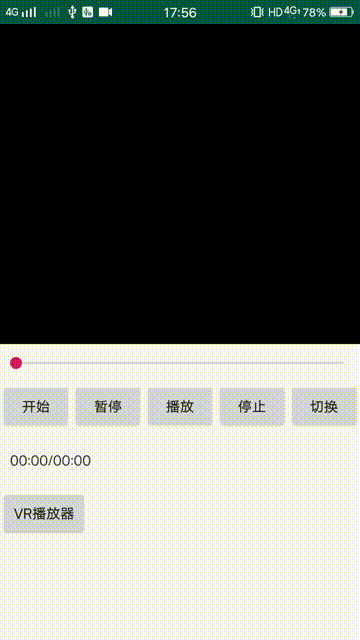

# WY_Music
万能播放器

##  支持 x86 cpu arm架构
##  Android 基于：FFmpeg+OpenSL+OpenGL+Mediacodec 的视频播放SDK，可播放网络、本地和广播等流媒。
##  支持播放VR360度全景视频
### 1、支持当前播放页直接切换播放源
### 2、优先选用GPU解码，解码速度更快
### 3、支持软解码和硬解码
### 4、直接用mediacodec解码avpacket数据。
### 5、支持用于传统直播和VR直播
### 6、底层使用FFmpeg解码支持各种格式的音视频播放
### 7、支持rtmp,http,hls等多种流媒体协议

# Demo预览





+ 播放传统视频

```javascript

 private WLPlayer wlPlayer;
 private GlSurfaceView glSurfaceView;
  //初始化
  glSurfaceView=findViewById(R.id.wlglsurfaceview);
  wlPlayer=new WLPlayer();
  wlPlayer.setWlOnParparedListener(new WlOnParparedListener() {
              @Override
              public void onParpared() {
                  System.out.println("播放");
                  wlPlayer.start();
              }
          });
  wlPlayer.setGlSurfaceView(glSurfaceView);
    //播放
  wlPlayer.setSource("http://vfx.mtime.cn/Video/2019/03/21/mp4/190321153853126488.mp4");
  wlPlayer.parpared();

```
+ 播放VR视频

```javascript
<<<<<<< HEAD
        private GlSurfaceView glSurfaceView;
=======
        private VrSurfaceView vrSurfaceView;
>>>>>>> c08c5e761feea40f2ce77073e9ed38e15a5faf69

         //初始化
        vrSurfaceView=findViewById(R.id.play_vr_glsv);
        player=new WLPlayer();
        player.setWlOnParparedListener(new WlOnParparedListener() {
            @Override
            public void onParpared() {
                MyLog.d("开始播放----");
                System.out.println("播放");
                player.start();
            }
        });

         player.setOpenVr(true);   //设置成播放VR视频
         player.setVrSurfaceView(vrSurfaceView);
         player.setSource(VIDEO_URL);
         player.parpared();

<<<<<<< HEAD
```
=======
```
><font color=red>注意！传统视频是用GlSurfaceView,而VR视频是用VrSurfaceView显示</font>

>>>>>>> c08c5e761feea40f2ce77073e9ed38e15a5faf69
